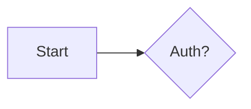

<objective>
Parse and extract Mermaid diagram blocks with their ASCII sidecar pairs from AI response content.

Purpose: Enable detection of mermaid+sidecar pairs so they can be displayed together in Phase 16
Output: DiagramBlock type and parseDiagramBlocks() utility function
</objective>

<execution_context>
@~/.claude/get-shit-done/workflows/execute-phase.md
@~/.claude/get-shit-done/templates/summary.md
</execution_context>

<context>
@.planning/PROJECT.md
@.planning/ROADMAP.md
@.planning/STATE.md
@.planning/phases/14-markdown-rendering/14-02-SUMMARY.md
@.planning/references/mermaid-skill.md

**Source files:**
@src/types/chat.ts
@src/services/ai/base.ts

**Tech stack available:**
- TypeScript 5.9.3
- Vue 3.5.26

**Established patterns:**
- Types in src/types/ with barrel exports
- Utilities can be in src/utils/

**Constraining decisions:**
- Phase 13: AI generates mermaid blocks followed immediately by text sidecar blocks
- Sidecar format: ```text block starting with "Diagram: <name> (<type>)"
- Mermaid and sidecar are always adjacent (sidecar immediately follows mermaid)

**Sidecar Pattern:**
```markdown

```text
Diagram: Auth flow (flowchart)
  [Start] --> {Auth?}
```
```
</context>

<tasks>

<task type="auto">
  <name>Task 1: Add DiagramBlock types</name>
  <files>src/types/chat.ts</files>
  <action>
Add types for parsed diagram blocks:

```typescript
export interface DiagramBlock {
  id: string                    // Unique ID for this block
  mermaidContent: string        // The mermaid diagram code
  sidecar?: SidecarBlock        // Optional ASCII sidecar
  startIndex: number            // Position in original content (for replacement)
  endIndex: number              // End position in original content
}

export interface SidecarBlock {
  content: string               // The ASCII diagram content
  name?: string                 // Extracted from "Diagram: <name>"
  type?: string                 // Extracted from "(<type>)"
}
```

These types will be used by the parser and display components.
  </action>
  <verify>npm run type-check passes</verify>
  <done>DiagramBlock and SidecarBlock types added to src/types/chat.ts</done>
</task>

<task type="auto">
  <name>Task 2: Create diagram block parser</name>
  <files>src/utils/diagramParser.ts</files>
  <action>
Create a utility function that parses markdown content and extracts mermaid+sidecar pairs:

```typescript
import type { DiagramBlock, SidecarBlock } from '@/types'

/**
 * Parse markdown content to extract mermaid blocks with their sidecars.
 *
 * Pattern: ```mermaid ... ``` immediately followed by ```text ... ```
 * The text block should start with "Diagram: <name> (<type>)"
 */
export function parseDiagramBlocks(content: string): DiagramBlock[] {
  const blocks: DiagramBlock[] = []

  // Regex to match mermaid block followed optionally by text sidecar
  // Group 1: mermaid content
  // Group 2: optional sidecar content (text block immediately after)
  const mermaidRegex = /```mermaid\n([\s\S]*?)\n```(?:\s*```text\n([\s\S]*?)\n```)?/g

  let match: RegExpExecArray | null
  let id = 0

  while ((match = mermaidRegex.exec(content)) !== null) {
    const mermaidContent = match[1].trim()
    const sidecarContent = match[2]?.trim()

    const block: DiagramBlock = {
      id: `diagram-${id++}`,
      mermaidContent,
      startIndex: match.index,
      endIndex: match.index + match[0].length,
    }

    if (sidecarContent) {
      block.sidecar = parseSidecar(sidecarContent)
    }

    blocks.push(block)
  }

  return blocks
}

/**
 * Parse sidecar content to extract name and type.
 * Format: "Diagram: <name> (<type>)\n<content>"
 */
function parseSidecar(content: string): SidecarBlock {
  const sidecar: SidecarBlock = { content }

  // Try to extract "Diagram: <name> (<type>)" from first line
  const headerMatch = content.match(/^Diagram:\s*([^(]+?)(?:\s*\(([^)]+)\))?\s*$/m)

  if (headerMatch) {
    sidecar.name = headerMatch[1].trim()
    sidecar.type = headerMatch[2]?.trim()
  }

  return sidecar
}

/**
 * Check if content contains any mermaid blocks with sidecars.
 */
export function hasDiagramBlocks(content: string): boolean {
  return /```mermaid\n[\s\S]*?\n```/.test(content)
}
```

Key considerations:
- Handle case where sidecar is missing (mermaid block alone)
- Handle multiple mermaid+sidecar pairs in one message
- Preserve start/end indices for potential content manipulation
- Extract name and type from sidecar header line
  </action>
  <verify>npm run type-check passes</verify>
  <done>parseDiagramBlocks() and hasDiagramBlocks() utilities created</done>
</task>

<task type="auto">
  <name>Task 3: Export and verify</name>
  <files>src/utils/index.ts, src/types/index.ts</files>
  <action>
1. If src/utils/index.ts doesn't exist, create it with exports from diagramParser
2. Add DiagramBlock and SidecarBlock exports to src/types/index.ts
3. Run type-check and build to verify

For src/utils/index.ts (create if needed):
```typescript
export * from './diagramParser'
```

For src/types/index.ts, add:
```typescript
export type { DiagramBlock, SidecarBlock } from './chat'
```
  </action>
  <verify>npm run type-check && npm run build succeeds</verify>
  <done>Types and utilities exported, build passes</done>
</task>

</tasks>

<verification>
Before declaring phase complete:
- [ ] `npm run type-check` passes
- [ ] `npm run build` succeeds
- [ ] DiagramBlock and SidecarBlock types defined
- [ ] parseDiagramBlocks() parses mermaid+sidecar pairs
- [ ] hasDiagramBlocks() detects presence of diagrams
</verification>

<success_criteria>

- All tasks completed
- All verification checks pass
- No TypeScript errors introduced
- Parser correctly extracts mermaid content and sidecar pairs
- Phase 15 complete
</success_criteria>

<output>
After completion, create `.planning/phases/15-sidecar-detection/15-01-SUMMARY.md`
</output>
